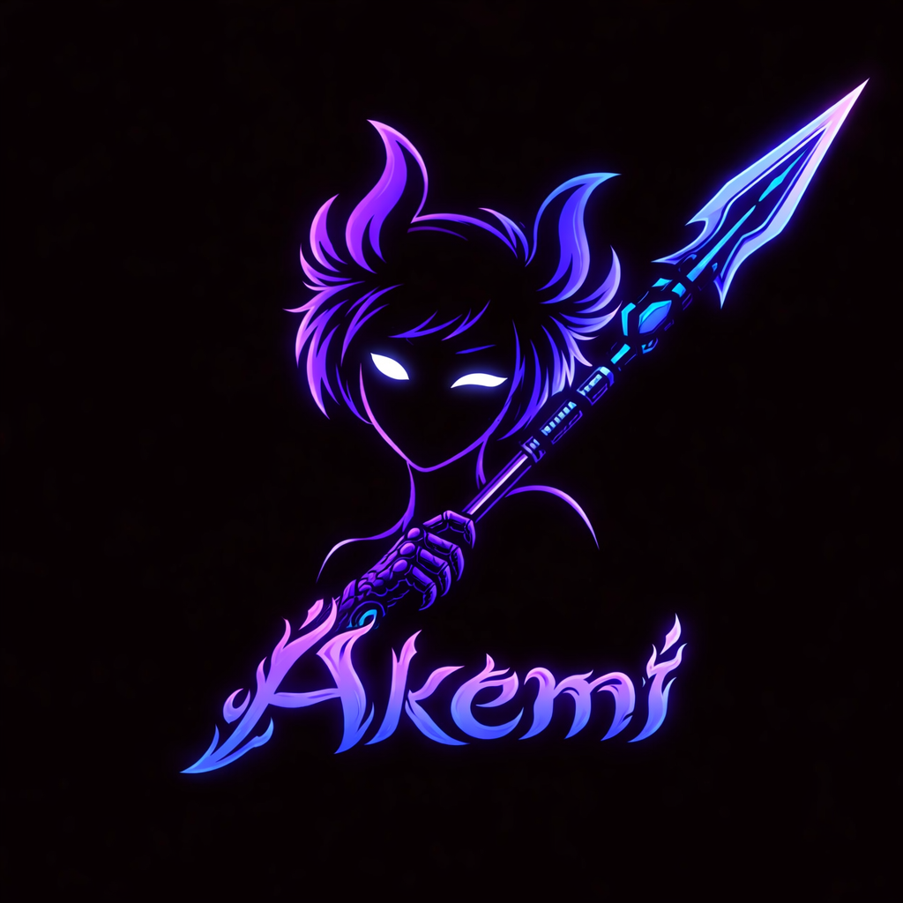
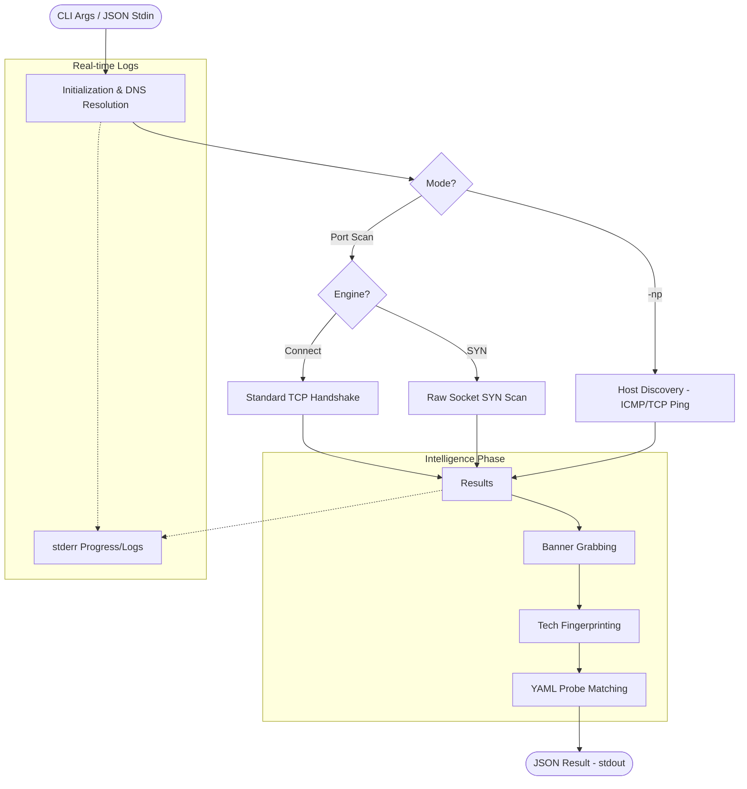

# Akemi-Spear

**Akemi-Spear** is a high-performance network reconnaissance and port scanning engine written in Rust. It serves as the primary scanning backend for the Akemi security framework, designed for speed, stealth, and extensible technology identification.

## ⚙️ Scanning Workflow



## 🚀 Key Features

- **Blazing Fast Scanning**: Built on the `tokio` async runtime for maximum I/O concurrency.
- **Dual Scan Engines**:
  - **Connect Scan**: Reliable TCP handshake scanning.
  - **SYN Scan**: High-performance "half-open" scanning using raw sockets (requires admin/root).
- **Intelligent Tech Detection**:
  - **Banner Grabbing**: Retrieves raw service banners.
  - **Built-in Fingerprints**: 50+ signatures for web servers, databases, frameworks, and protocols.
  - **YAML Probe Templates**: Fully extensible signature system for custom service discovery.
- **Host Discovery (`--no-port`)**: High-speed CIDR sweeping to identify live hosts via ICMP and TCP-ping methods.
- **Stealth & Evasion**:
  - **Port Randomization**: Shuffles the order of ports and hosts to evade threshold-based detection.
  - **Rate Limiting**: Granular control over packets-per-second (`--rate`) to avoid network saturation.
- **Operational Robustness**:
  - **Resume Support**: Save scan state to a file and resume interrupted sessions.
  - **JSON First Architecture**: Native support for JSON input/output for easy orchestration.

## 🛠️ Usage

### Standalone CLI

```bash
# Basic connect scan
./akemi-scanner --host 192.168.1.1 --ports 22,80,443 -v

# High-speed SYN scan (requires root)
sudo ./akemi-scanner --host 10.0.0.0/24 --ports 1-65535 --syn --rate 2000

# Host discovery only (no port scan)
./akemi-scanner --host 172.16.0.0/16 --no-port
```

### Options

| Flag | Description | Default |
| :--- | :--- | :--- |
| `--host` | Target IP, Hostname, or CIDR range | (Required) |
| `--ports` | Comma-separated list or range (e.g., `22,1-1024`) | `""` |
| `--threads`, `-c` | Maximum concurrent connections | `200` |
| `--timeout_ms`, `-T` | Timeout per port in milliseconds | `3000` |
| `--rate` | Packets per second limit (0 = unlimited) | `0` |
| `--syn` | Use SYN scan mode (requires privileges) | `false` |
| `--no-port` | Host discovery mode only | `false` |
| `--banner-grab` | Enable banner grabbing and tech detect | `true` |
| `--resume-file` | Path to save/load scan state | `""` |
| `--stdin` | Read ScanRequest JSON from stdin | `false` |

### Integration (JSON Mode)

Akemi-Spear is designed to be orchestrated. You can pipe a JSON request directly into it:

**Request (`input.json`):**
```json
{
  "host": "scanme.nmap.org",
  "ports": [22, 80, 443],
  "threads": 100,
  "banner_grab": true
}
```

**Execution:**
```bash
cat input.json | ./akemi-scanner --stdin
```

## 🏗️ Architecture

Akemi-Spear is modularly designed for clarity and performance:

- **`main.rs`**: CLI parsing and mode orchestration.
- **`scanner.rs`**: Core async logic for TCP connect scanning.
- **`syn_scanner.rs`**: Raw socket implementation using `pnet`.
- **`host_discovery.rs`**: Multi-method CIDR sweeping logic.
- **`tech_detect.rs`**: Compiled regex database for service fingerprinting.
- **`banner_grabber.rs`**: Protocol-aware banner retrieval.
- **`models.rs`**: Strong type definitions for JSON contracts.

## ⚙️ Compilation

Requires **Rust 1.70+**.

### Standard Build
```bash
cargo build --release
```

### Build with SYN Scan Support (Recommended)
```bash
cargo build --release --features syn-scan
```

> [!NOTE]
> On Windows, SYN scanning requires **Npcap** (or WinPcap) to be installed in "WinPcap API-compatible mode".

## 📜 License
Internal tool for the Akemi Security Framework. Part of the **赤 Akemi** suite.
