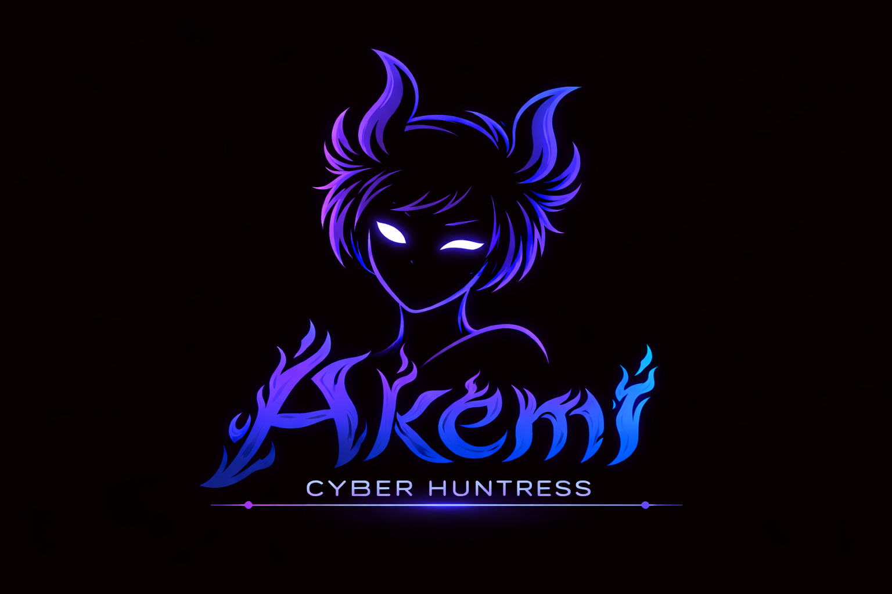
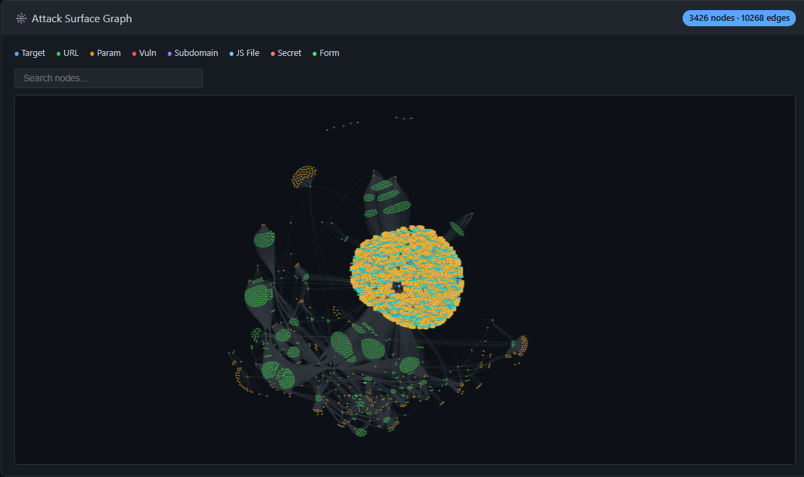

# Akemi: Autonomous Attack Surface Management

> ⚠️ **Nightly Build (v2.0.0-dev)** — This branch contains active development. Things may break.
> For the stable release, see the [Releases page](https://github.com/your-org/akemi/releases) and download **Akemi v1.0.0**.

**Akemi v2** is an AI-augmented, modular attack surface management framework that combines high-performance reconnaissance with LLM-driven autonomous agents. It can map, probe, and validate entire attack surfaces — either manually via CLI or autonomously through an AI agent that plans and executes engagements for you.

The framework integrates high-speed network triage (Akemi-Spear), deep web discovery, a YAML-driven vulnerability engine, and an LLM agent system into a single, cohesive environment with an optional rich terminal UI.

---

## ⚡ Key Highlights

### 🤖 LLM Agent System (NEW in v2)
Akemi v2 introduces an autonomous AI agent that can plan and execute entire engagements:
- **Multi-Vendor LLM Support**: Anthropic (Claude), OpenAI (GPT-4o), DeepSeek, Google (Gemini), and local models via Ollama/vLLM.
- **Autonomous Planning**: The agent analyzes targets, selects tools, and executes multi-step attack surface discovery — with human confirmation for destructive actions.
- **Safety Controls**: Configurable scope (domains, CIDRs), rate limiting, and risk levels (safe → intrusive).
- **Built-in Assistant**: Interactive chat interface for guided reconnaissance sessions.

### 🖥️ Terminal UI Dashboard (NEW in v2)
A rich, keyboard-driven TUI for real-time engagement monitoring:
- **Live Dashboards**: Track discovery, fuzzing, agent tasks, and findings in real time.
- **Notification System**: Inline alerts for high-severity findings and agent decisions.
- **Dark/Light Themes**: Customizable styling for your terminal.

### 🔌 MCP Server & Client (NEW in v2)
- **MCP Server**: Expose Akemi as a tool source for Claude Desktop and other MCP-compatible LLM hosts via stdio or HTTP (Streamable HTTP).
- **MCP Client**: Consume external MCP tools from other servers, bridging them into Akemi's agent workflow.

### 🍯 DotHound: Credential Capture (NEW in v2)
- **Browser-Based Auth Capture**: Bundled LibreWolf instance that proxies traffic and captures authentication tokens, cookies, and form submissions.
- **CA Injection**: Dynamic certificate authority for MITM-style capture during engagements.
- **Export**: Dump captured credentials as structured JSON for downstream use.

### ⚡ Akemi-Spear: High-Performance Recon Engine
At the heart of Akemi lies **Akemi-Spear**, a Rust reconnaissance engine built for speed and stealth:
- **High-Speed Host Discovery**: Multi-threaded sweep and SYN scanning capabilities.
- **Service Fingerprinting**: Efficient banner collection and service-oriented triage.
- **Port Scanning**: Template-based and customizable scanning logic optimized for reliability.
- **Resume Support**: Interrupted scans can be resumed from the last checkpoint.

### 🧪 YAML-Driven Vulnerability Validation
Akemi moves beyond simple discovery with its **Probe Engine**. It uses a flexible, YAML-driven approach to validate vulnerabilities across your attack surface:
- **Customizable Templates**: The `probes/` directory contains active checks for SQLi, RCE, SSRF, deserialization, and more.
- **Protocol Agnostic**: Validate findings across HTTP, DNS, and TCP using structured logic.
- **Tag-Based Filtering**: Run only the templates relevant to your engagement (e.g., `--vuln-check-tags sqli,lfi`).

---

## 🧩 Core Capabilities

### Reconnaissance
- **Attack Surface Mapping**: Automated web crawling, subdomain enumeration, and endpoint extraction.
- **Dynamic Parameter Mining**: Deep discovery of parameters from URLs, forms, JSON, and JavaScript files.
- **JavaScript Analysis**: Scrutinizes JS files for endpoints, secrets, and sensitive logic.
- **Port Scanning**: High-speed TCP and SYN scanning via Akemi-Spear.

### Vulnerability Validation
- **YAML Probe Engine**: Structured, template-driven vulnerability checks (Nuclei-inspired).
- **Fuzzing**: Parameter-based fuzzing with customizable wordlists and concurrency.
- **ExploitDB Correlation**: Match identified services/versions against the ExploitDB dataset.

### AI & Automation
- **Autonomous Agent**: LLM-powered planner that chains tools to achieve engagement goals.
- **Interactive Assistant**: Conversational interface for guided recon sessions.
- **Tool Bridge**: MCP client/server for cross-tool interoperability with Claude Desktop and other hosts.

### Visualization & Reporting
- **Relational Graphing**: Export scan results as interactive HTML or DOT graphs.
- **Comprehensive Reports**: Generate detailed HTML and JSON reports for every engagement.
- **TUI Dashboard**: Real-time terminal-based monitoring of all running tasks.

### Persistence & Archiving
- **SQLite/Postgres Backend**: Store engagements, findings, and agent state.
- **Session Archiving**: Save and restore complete engagement sessions.
- **Resume Support**: Interrupted scans and tasks can pick up where they left off.

---

## 📁 Repository Layout

```text
cmd/
  Akemi/                   CLI entrypoint & commands
internal/
  app/                     Core framework orchestration
  agent/                   LLM agent: planner, executor, memory, safety
  llm/                     Multi-vendor LLM clients (Anthropic, OpenAI, DeepSeek, Google, local)
  assistant/               Interactive AI assistant
  mcp/                     MCP server: tools, resources, prompts, transports
  mcpclient/               MCP client: tool routing & aggregation
  recon/                   Crawl, scrape, JS analysis, subdomain enumeration
  vuln/                    YAML probe engine & vulnerability checks
  fuzzing/                 Parameter fuzzing engine
  reporting/               HTML/JSON report & graph generators
  reportfiles/             Report file management
  tui/                     Terminal UI dashboard
  config/                  TOML configuration management
  persist/                 Database persistence (SQLite/Postgres)
  session/                 Engagement session state
  engagement/              Engagement lifecycle management
  surface/                 Full attack surface aggregation
  dothound/                DotHound integration
  toolbridge/              External tool bridging
  archive/                 Session archiving
  service/                 Service layer (discovery, reporting, scanner, vuln, subdomain)
  core/                    Shared types, errors, interfaces
  platform/                Platform-specific utilities (proxy)
Akemi-Spear/               High-performance Rust recon engine (port scan, banner grab, host discovery)
DotHound/                  Rust-based credential capture tool (MITM proxy + LibreWolf)
config/                    Runtime and proxy configuration examples
probes/                    YAML vulnerability templates
.github/                   CI/CD workflows
```

---

## 🚀 Quick Start

> ⚠️ **This is v2.0.0 nightly.** For stable v1.0.0, grab a pre-built binary from the [Releases page](https://github.com/your-org/akemi/releases).

### Configuration

Copy the example config and edit it with your settings:

```bash
cp akemi.conf.example akemi.conf
# Edit akemi.conf — add API keys for LLM providers you want to use
```

### Build Instructions

Use the provided PowerShell script to build optimized binaries for Windows and Linux:

```powershell
./build.ps1
```

**Requirements:**
- Go `1.25.0` or higher
- Rust stable toolchain (for Akemi-Spear and DotHound)

### Linux Installation

For Linux users, a dedicated installer script is provided to handle dependencies and automated building:

```bash
chmod +x installer.sh
./installer.sh
```

The script will:
- Install system dependencies (`libpcap-dev`, `libssl-dev`, etc.)
- Verify/Install Go and Rust toolchains
- Compile the core engine, Akemi-Spear, and DotHound
- Optionally symlink binaries to `/usr/local/bin`

---

## 📋 Common Workflows

### 1. Autonomous Agent Engagement (NEW)
Let the LLM agent plan and execute a full attack surface mapping:
```bash
Akemi.exe agent --goal "Map the attack surface of example.com, discover subdomains, scan top 1000 ports, and probe for SQLi"
```

### 2. Full Surface Mapping (Manual)
Discover everything on a target, including parameters and JavaScript endpoints:
```bash
Akemi.exe -u https://target.com --crawl --depth 3 --params --js --scrape --graph --report-dir ./results
```

### 3. Infrastructure Triage & Port Scanning
Leverage Akemi-Spear for high-speed scanning:
```bash
Akemi.exe --targets targets.txt --port-scan -p 80,443,8080 --rate 1000
```

### 4. Vulnerability Probing
Validate high-impact vulnerabilities with structured templates:
```bash
Akemi.exe -u https://target.com --vuln-check --vuln-check-tags sqli,lfi
```

### 5. MCP Server Mode (NEW)
Expose Akemi as a tool source for Claude Desktop:
```bash
Akemi.exe serve --mcp-transport stdio
```

### 6. TUI Dashboard (NEW)
Launch the interactive terminal dashboard:
```bash
Akemi.exe interactive
```

### 7. Relational Graph Generation
Visualize the discovered surface and its connections:
```bash
Akemi.exe -u https://target.com --crawl --graph --report-dir ./results
```

---

## 📄 License

This tool is provided for educational purposes and authorized security assessments only. Do not use this tool for any illegal activities. You may fork, modify, and share it with the community. Redistribution or sale of this software is not authorized.

---

> 🏗️ **Akemi v2.0.0-dev** — under active development. For the stable v1.0.0 release, visit the [Releases page](https://github.com/your-org/akemi/releases).


